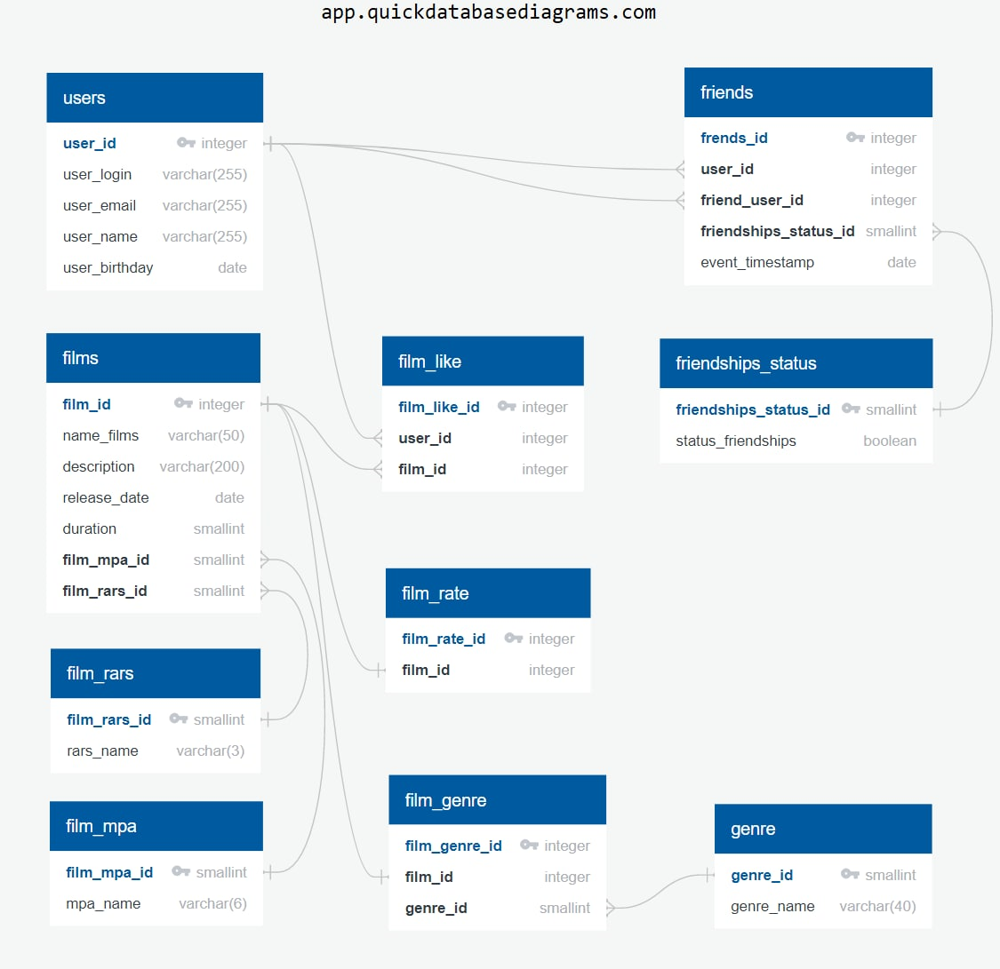
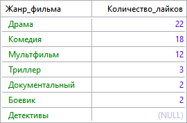

# `FilmoRate` :movie_camera:
____
# **_Spring Boot_** приложениe
____
## Описание
#### Фильмов много — и с каждым годом становится всё больше. Чем их больше, тем больше разных оценок. Чем больше оценок, тем сложнее сделать выбор. Однако не время сдаваться! Сервис - `FilmoRate` - поможет пользователю сделать выбор. Теперь ни вам, ни вашим друзьям не придётся долго размышлять, что посмотреть вечером.[1](https://practicum.yandex.ru/ "Яндекс Практикум")

## Руководство по эксплуатации

### Технологический стек
#### Языки программирования
- JAVA
- SQL

#### Используемый Framework's
- Spring Boot

#### Система сборки
- Maven

#### База данных
- PostgreSQL

### Архитектура
- REST API

### Модели данных
- **_User_**
  - :white_check_mark: id - целочисленный идентификатор
  - :white_check_mark: login - логин пользователя
  - :white_check_mark: email - электронная почта
  - :white_check_mark: name - имя для отображения
  - :white_check_mark: birthday - дата рождения
  - :white_check_mark: listFriend - список друзей
  - :black_square_button: statusFriends - заявки в друзья

- **_Film_**
  - :white_check_mark: id - целочисленный идентификатор
  - :white_check_mark: name - название
  - :white_check_mark: description - описание, не более 200 символов
  - :white_check_mark: releaseDate - дата релиза
  - :white_check_mark: duration - продолжительность фильма
  - :white_check_mark: like - количество лайков

- **_MPA_** - рейтинг Ассоциации кинокомпаний
  - :black_square_button: id - целочисленный идентификатор
  - :black_square_button: name - возрастное ограничение для фильма
  - 
- **_RARS_** - возрастная классификация информационной продукции в России
  - :black_square_button: id - целочисленный идентификатор
  - :black_square_button: name - возрастное ограничение для фильма

- **_Жанр фильма_** - рейтинг Ассоциации кинокомпаний
  - :black_square_button: id - целочисленный идентификатор
  - :black_square_button: name - название жанра

### Пользовательский интерфейс
- регистрация/обновление/удаление пользователей
- добавление/удаление друзей
- вывод общих друзей с пользователем
- получение списка всех пользователей

### Используемый контент
- Кинофильмы

### Интерфейс для контента
- добавление/удаление/обновление фильма 
- проставление/удаление лайков
- добавление/удаление/обновление жанра
- добавление/удаление/обновление возрастного ограничения
- формирование рейтинга

### Дополнительные возможности по работе с другими моделями данных
- добавление
- обновление
- удаление

### :black_square_button: Логирование

### :black_square_button: Таблицы в базе данных
- users - таблицы с зарегистрированными пользователями
- friends - таблица для связи «дружба» между двумя пользователями
- friendships_status - таблица для отражения отношения «дружба» подтверждённая/неподтверждённая
- films - таблицы добавленных фильмов 
- film_genre - таблица связи «films-genres»
- genres - таблица с жанрами
- film_like - таблица с лайками пользователей 
- film_rate - таблица рейтинга фильмов
- film_mpa - таблица возрастных ограничений для фильма Ассоциации кинокомпаний (англ. Motion Picture Association, сокращённо МРА)
- films_rars - возрастная классификация информационной продукции в России (англ. Russian Age Rating System, сокращённо RARS)


### :white_check_mark: ER-диаграмма (от англ. entity-relationship diagram, диаграмма «сущность - связь»)


## Примеры запросов для основных операций приложения **_Spring Boot_** приложения: `FilmoRate` :movie_camera:
1. Вывести список фильмов имеющихся в коллекции
```
SELECT *  
FROM films;
```
2. Вывести первые 10 фильмов, согласно рейтинга
```
SELECT f.name_films, f_r.film_rate_id 
  FROM films AS f
  INNER JOIN film_rate AS f_r ON f.film_id = f_r.film_id
  ORDER BY f_r.film_rate_id ASC
  LIMIT 10;
```
3. Вывести названия фильмов, которым пользователь № 1 поставил 'лайки'
```
SELECT fl.user_id, f.name_films
FROM films AS f
INNER JOIN film_like AS fl ON f.film_id = fl.film_id
WHERE fl.user_id = 1;
```
4. Вывести названия первых 5 фильмов по количеству лайков.
```
SELECT f.name_films
FROM film_like AS fl
 INNER JOIN films AS f ON fl.film_id = f.film_id
GROUP BY fl.film_id
ORDER BY COUNT(fl.film_id) DESC
LIMIT 5;
```

5. Вывести названия фильмов и проставленных лайков с сортировкой на уменьшение количества лайков
```
SELECT f.name_films,
       COUNT(f.film_id) AS 'Количество лайков'
FROM film_like AS fl
INNER JOIN films AS f ON fl.film_id = f.film_id
GROUP BY f.name_films
ORDER BY COUNT(f.film_id) DESC
LIMIT 7;
```
6. Количество проставленных лайков по видам жанра
```
SELECT g.genre_name AS Жанр_фильма,
       SUM(cf.likes) AS Количество_лайков
FROM (
      SELECT f.film_id, f.name_films,
             COUNT(f.film_id) AS likes
      FROM film_like AS fl
      INNER JOIN films AS f ON fl.film_id = f.film_id
      GROUP BY f.name_films
     ) AS cf
LEFT JOIN film_genre AS fg ON cf.film_id = fg.film_id
RIGHT JOIN genre AS g ON fg.genre_id = g.genre_id
GROUP BY Жанр_фильма
ORDER BY Количество_лайков DESC;
```


7. Удалить из коллекции фильм, с названием 'ERROR'
```
DELETE 
FROM films AS f
WHERE f.name_films = 'ERROR';
```
8. Добавить пользователя 
```
INSERT INTO users (user_login, user_name, user_birthday, user_email)
VALUES ('login', 'name', '1999-2-2', 'login@mail.ru');
```
9. Вывести данные пользователя № 1 (логин, имя, дата рождения, адрес электронной почты) соответственно
```
SELECT u.user_login, u.user_name, u.user_birthday, u.user_email
FROM users AS u
WHERE u.user_id = 1
```
10. Вывести список друзей пользователя № 1
```
SELECT f.friend_user_id 'Список друзей пользователя' 
FROM friends AS f
WHERE f.user_id = 1 AND f.friendships_status_id = 1;
```

11. Обновить адрес электронной почты пользователя № 3
```
UPDATE users AS u
SET u.user_email = 'grigoriy@email.ru'
WHERE u.user_id = 3;
```
